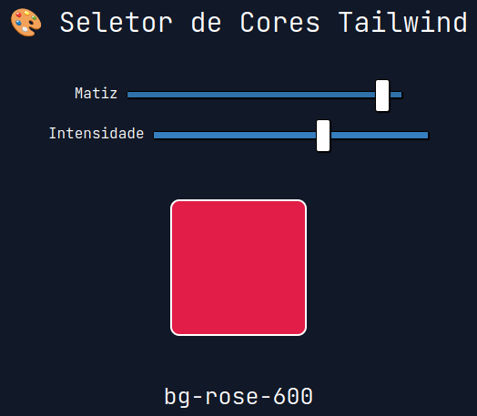

Seletor de cores para o Tailwind feito em TypeScript.
Selecione a matiz e a intensidade da cor e previsualize-a diretamente no navegador.
Você também pode obter a classe Tailwind equivalente àquela cor, conforme o exemplo acima.

[TESTE AGORA!]()